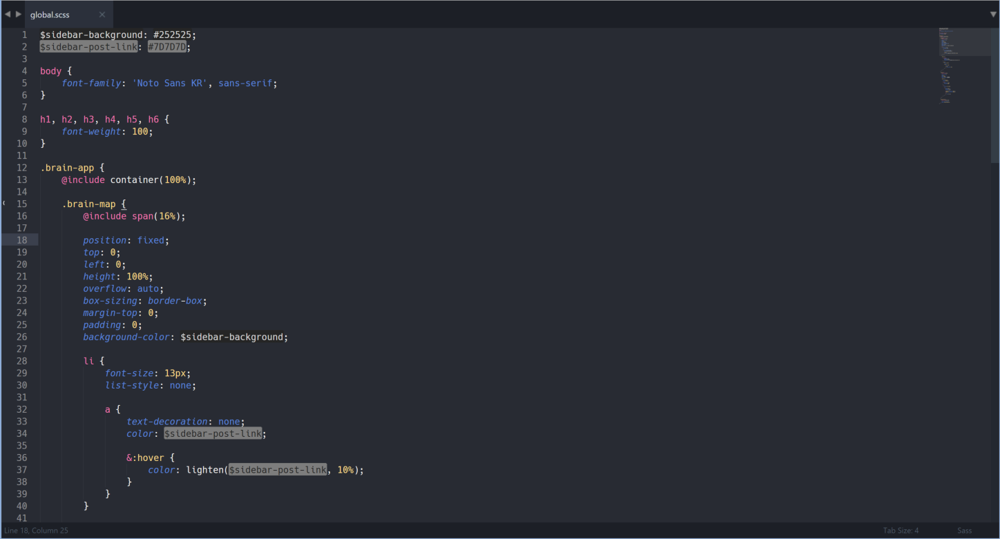

# Sublime Clayful Theme

Clayful Theme for [SublimeText](http://www.sublimetext.com/) designed by Clayful

This repository includes two different theme including:

- Clayful Dark
- Clayful Light

## How to Install
1. Download or clone repository
2. Make a directory named `Clayful - Theme` in Sublime's package directory (`Preferences > Browse Packages`)
3. Copy `theme` folder into `Clayful - Theme` folder
4. Enable one of color themes in `Preferences > Color Scheme > Clayful - Theme`

## Designed with
- [TmTheme Editor](tmtheme-editor.herokuapp.com)

## License
- [MIT](https://opensource.org/licenses/MIT)
